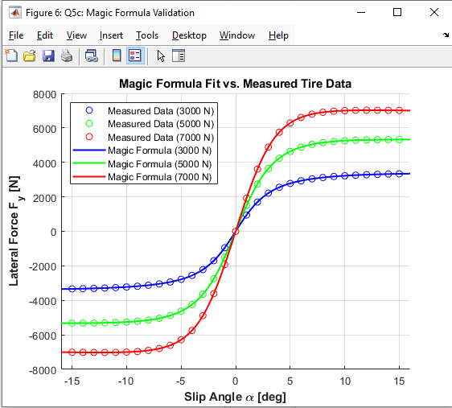
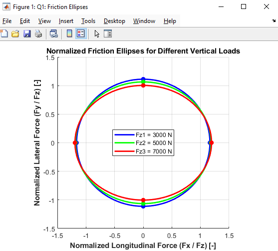
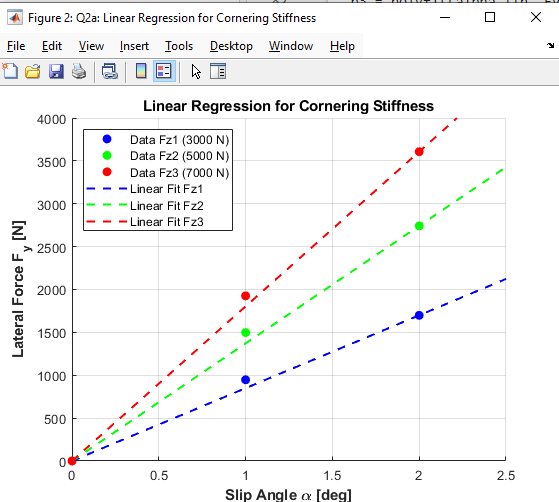
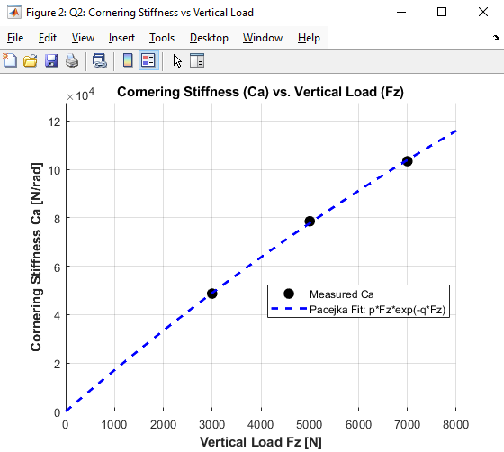
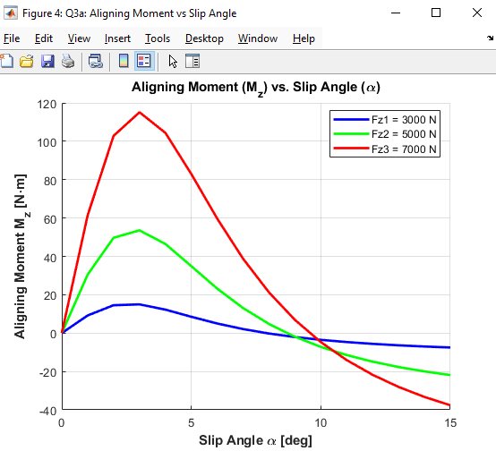
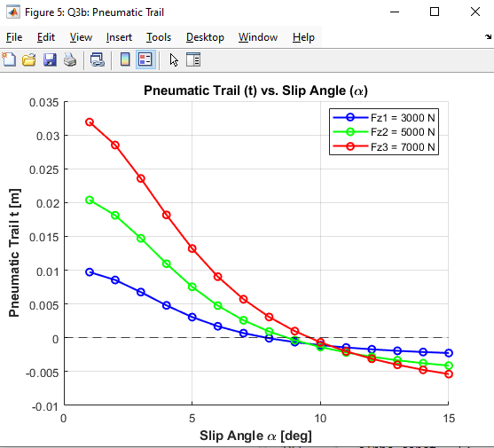
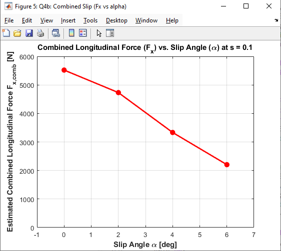
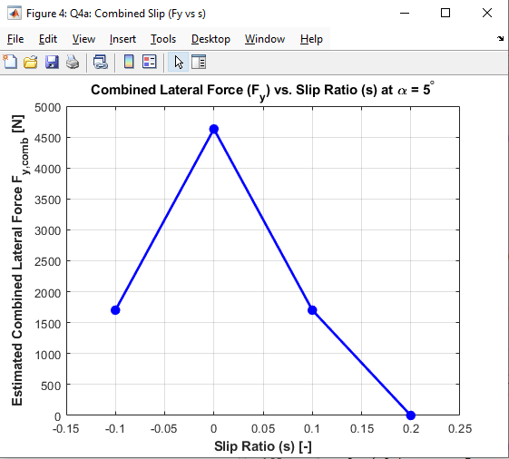

# Pacejka Tire Modeling & Optimization 🏎️

This repository contains a comprehensive MATLAB-based analysis of vehicle tire dynamics using experimental data. Developed as part of the **MKT4834 Introduction to Vehicle Dynamics** course, this project focuses on tire force characterization, combined slip approximations, and the optimization of Pacejka's Magic Formula parameters, including load-dependent coefficients ($a_1-a_8$).

## 📌 Project Highlights
* **Data Processing:** Extraction and handling of raw experimental tire data ($F_x$, $F_y$, $M_z$) under various vertical loads ($F_z$: 3000N, 5000N, 7000N).
* **Friction Ellipse:** Visualization of normalized longitudinal and lateral force capacities, demonstrating tire load sensitivity.
* **Cornering Stiffness ($C_\alpha$):** Linear regression at low slip angles and derivation of Pacejka's exponential load-dependent model.
* **Self-Aligning Moment & Pneumatic Trail:** Analysis of $M_z$ and calculation of the pneumatic trail ($t$) zero-crossing points.
* **Combined Slip Estimation:** Predictive modeling of tire forces under simultaneous longitudinal and lateral slip using friction ellipse boundaries.
* **Magic Formula Optimization:** Reverse-engineering the foundational tire parameters ($B, C, D, E$) using nonlinear least-squares curve fitting (`lsqcurvefit`), and expanding to load-dependent coefficients ($a_1-a_8$).

---

## 📊 Key Results & Visual Showcase

### 1. Pacejka Magic Formula Validation
The core of the project involves optimizing the Magic Formula ($F_y = D \cdot \sin(C \cdot \arctan(B\alpha - E(B\alpha - \arctan(B\alpha))))$) parameters. The model achieves an $R^2$ of 1.0000, perfectly matching the measured data.

### 2. Normalized Friction Ellipses
Demonstrating the combined force limits. Notice how the normalized capability ($\mu$) decreases as the vertical load increases, validating tire load sensitivity.

### 3. Cornering Stiffness Analysis
Extracting cornering stiffness ($C_\alpha$) via linear regression at low slip angles, followed by a Pacejka exponential fit: $C_\alpha = p \cdot F_z \cdot \exp(-q \cdot F_z)$.
| Linear Regression ($C_\alpha$) | Pacejka Exponential Fit |
| :---: | :---: |
|  |  |

### 4. Self-Aligning Moment & Pneumatic Trail
Analyzing the self-aligning torque ($M_z$) and the resulting pneumatic trail ($t = -M_z / F_y$) to identify critical zero-crossing points where self-aligning torque shifts direction.
| Aligning Moment ($M_z$) | Pneumatic Trail ($t$) |
| :---: | :---: |
|  |  |

### 5. Combined Slip Dynamics
Estimations of how longitudinal ($F_x$) and lateral ($F_y$) forces degrade when the tire is subjected to combined slip demands.
| Lateral Force at $s = 0.1$ | Longitudinal Force at $\alpha = 5^\circ$ |
| :---: | :---: |
|  |  |

---
*Developed by a Mechatronics Engineering Student for MKT4834 - Spring 2026*
